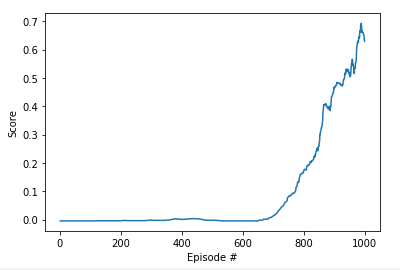

## Multi-agent reinforcement learning
# Collaboration and competition
##### _~a.k.a. Solving the game of two fly clappers ~_

<br> Let's begin


### Context

This project demonstrates an approach to solve multi-agent training problem on the example of the Tennis environment. In this environment there are two agent, which play against each other (competition). The presented solution uses a collective experience buffer, shared between both players (collaboration).
For this project the Deep Deterministic Policy Gradient methods was used as an algorithm to train the agent(s).

#### Deep Deterministic Policy Gradient (DDPG)

DDPG belongs to the group of actor-critic methods, which leverage the strengths of both policy-based and value-based methods. It uses a stochastic behaviour policy for exploration and uses an estimate deterministic target policy.

The DDPG method relies on two networks: a “critic”, that estimates the value function or state-value, and an “actor” that updates the policy distribution in the direction suggested by the critic. The actor directly maps states to actions instead of returning a probability distribution across a discrete action space. The actor represents the application of the Policy Gradient method. The DDPG uses deterministic policy gradients on contrary to stochastic policy methods: "In the stochastic case, the policy gradient integrates over both state and action spaces, whereas in the deterministic case it only integrates over the state space." [Silver et al. (2014)](http://proceedings.mlr.press/v32/silver14.pdf).

##### DDPG pseudo-algorithm
After [Lillicrap et al. (2016)](https://arxiv.org/abs/1509.02971):
- random initialization of actor and critic networks
- initialize target network
- initialize replay buffer
- for all episodes:
	- initialize a random process
	- receive initial observation state
	- for all time instances:
		- select action considering current policy and noise
		- execute action and collect reward and get new states
		- store the experience tuple to the replay buffer
		- sample an experience tuple from replay buffer - at random
		- set the target
		- update critic using the loss function
		- update the actor policy using the sampled policy gradient
		- update the target network


### 1. Approach

I started out from the code for the ddpg-pendulum environment solution from the [udacity deep-reinforcement-learning repo](https://github.com/udacity/deep-reinforcement-learning/tree/master/ddpg-pendulum).
In the first steps I modified the environment specific variables from the openGym, to the udacity environment. For the solution of the environment I used the Deep Deterministic Policy Gradient (DDPG) algorithm.


### 2. Implementation
#### Modification of the neural network

##### Batch normalization
I added batch normalization to the NN, for both actor and critic classes.

```python
self.bn1 = nn.BatchNorm1d(fc1_units)
```

This alone did not improvement the score much. In addition, to overcome array dimensionality error in the forward pass, the states have to be "unsqueeze"-ed.
```python
if state.dim() == 1:
  state = torch.unsqueeze(state, 0)
```

##### Gradient clipping
The implementation of gradient clipping is via the `clip_grad_norm` method, and the it is placed after the `backward()` and the next step of the __critic__ optimizer in the `ddpg_agent.py` file [here](https://github.com/bkocis/DRLND_Pr_2_Continuous_Control/blob/master/ddpg_agent_Copy2.py#L119)

```python
torch.nn.utils.clip_grad_norm_(self.critic_local.parameters(), 1)
```

#### Modification to the agent

In the starting code implementation from the ddpg-pendulum example, additionally the Ornstein-Uhlenbeck and the Replay buffer (experience replay) have been already implemented. In addition I extended and modified the following aspects of the original code base:

##### Epsilon-greedy implementation

I also tried to implement to epsilon-greedy decay. The values of the noise is multiplied by the epsilon factor, which is decreasing after each step of the action method.


### 3. Environment solutions

The provided code implementation resulted in solving the environment in 834 episodes!

The average scores are plotted below:




#### Hyperparameters used

The table list out the best set of parameters after many experiments:

| parameter | value |
| --- | --- |
| N nodes critic  | 300, 200 |
| N nodes actor | 300, 200 |
|BUFFER_SIZE replay buffer size | int(1e9)  |
|BATCH_SIZE minibatch size | 128        |
|GAMMA discount factor | 0.99            |
|TAU soft update of target parameters | 1e-3              |
|LR_ACTOR  learning rate of the actor | 1e-3         |
|LR_CRITIC learning rate of the critic| 1e-3     |
|WEIGHT_DECAY L2 weight decay | 0     |
|EPSILON  epsilon noise | 1.0        |
|EPSILON_DECAY decay rate for noise| 1e-6 |   
| sigma OUNoise | 0.2 |
| theta OUNoise | 0.15 |
| mu OUNoise | 0 |

### Future Work / Improvement points

- share experiences between the two agents OR define to separate agents that are not sharing experiences between each other

- Reproducibility of good training session

For the used model defined with parameters in the hyperparameters table, I needed to realize that the replay buffer size has to be really big (1e9). With value of 1e6 I needed to re-run training multiple times to achieve a good score (0.5 over 100 episodes).
However, when I increased the buffer size to 1e9, the good training sessions were easily reproducible.

Intuitively I was expecting that a bigger buffer should not be advantageous in the case of random sampling of the experience tuples from the buffer. if I make the buffer too big, then the sampling of it would also be unfavourable to pull successful action-state tuples

- Prioritized experience replay

The problem of reproducibility of a successful training session (generalization)
Random sampling of the replay buffer - the `sample` method of the Replay Buffer class of the ddpg_agent is using random sampling of the stored experience tuples. It has been proven by [Schaul el al. (2016)](https://arxiv.org/pdf/1511.05952.pdf) that prioritization of the experiences has very benefitial effect on the generalization of the environment solution and successful training of the agents.


